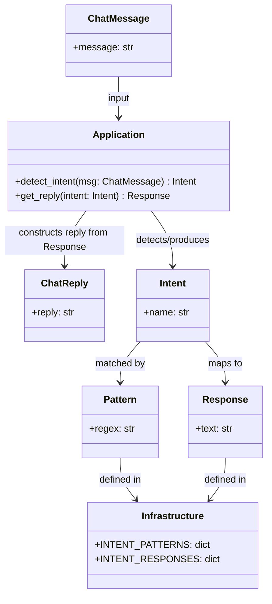

# Mini Chat System (Refactored)

A small intent-based chat API built with FastAPI, following a simple Clean Architecture split:
- Domain (models): validation and serialization
- Application (use-cases): intent detection and reply orchestration
- Infrastructure: intent patterns and canned responses
- API (interface): HTTP endpoints exposing the service

Files:
- [src/main.py](src/main.py)
- [src/domain.py](src/domain.py)
- [src/application.py](src/application.py)
- [src/infrastructure.py](src/infrastructure.py)
- [pyproject.toml](pyproject.toml)

Key symbols:
- [`domain.ChatMessage`](src/domain.py) — incoming request model
- [`domain.ChatReply`](src/domain.py) — outgoing response model
- [`application.handle_chat_message`](src/application.py) — main service function
- [`application.detect_intent`](src/application.py) — intent extractor
- [`application.get_reply`](src/application.py) — reply selector
- [`infrastructure.INTENT_PATTERNS`](src/infrastructure.py) — regex intent matchers
- [`infrastructure.INTENT_RESPONSES`](src/infrastructure.py) — canned replies

Architecture (Mermaid)
```mermaid
graph LR
  Client -->|HTTP| API[FastAPI\nsrc/main.py]
  API --> Domain[Domain Models\nsrc/domain.py]
  API --> App[Application Layer\nsrc/application.py]
  App --> Infra[Infrastructure\nsrc/infrastructure.py]
  Infra --> Patterns[INTENT_PATTERNS]
  Infra --> Responses[INTENT_RESPONSES]
  App -->|uses| Patterns
  App -->|uses| Responses
  API -->|calls| handle[handle_chat_message\n(detect_intent, get_reply)]
```

Entity Relationship (Mermaid class diagram)


Run locally
1. Install dependencies from [pyproject.toml](pyproject.toml):
```sh
uv sync --locked
# or use pip to install fastapi and uvicorn directly
```

2. Start the server:
```sh
uv run uvicorn src.main:app --reload --port 8000
```

3. Endpoints
- POST /chat — accept JSON matching [`domain.ChatMessage`](src/domain.py), returns [`domain.ChatReply`](src/domain.py)
- GET / — health/info

Example request:
```sh
curl -X POST "http://127.0.0.1:8000/chat" -H "Content-Type: application/json" -d '{"message":"hi"}'
```

Design notes
- Domain models are in [src/domain.py](src/domain.py).
- Application logic is orchestrated in [src/application.py](src/application.py) via [`application.handle_chat_message`](src/application.py).
- Matching rules and responses are data-driven in [src/infrastructure.py](src/infrastructure.py).
- This keeps validation, business logic, and data/configuration separated and testable.